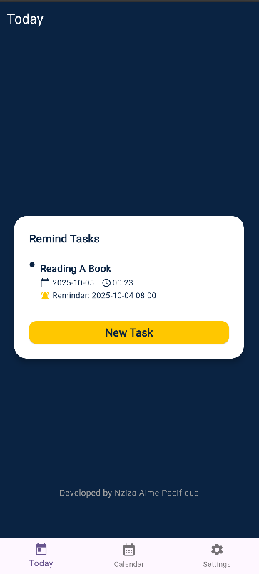
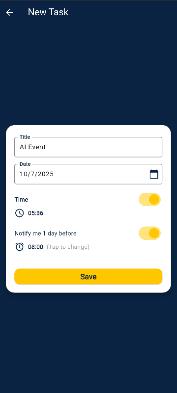
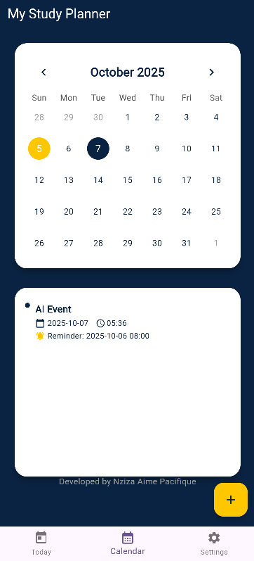
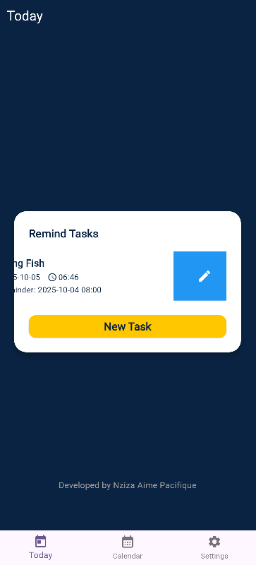
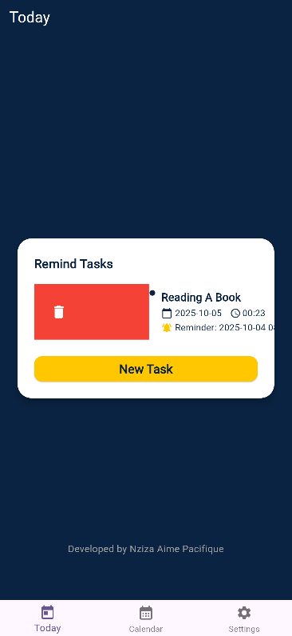
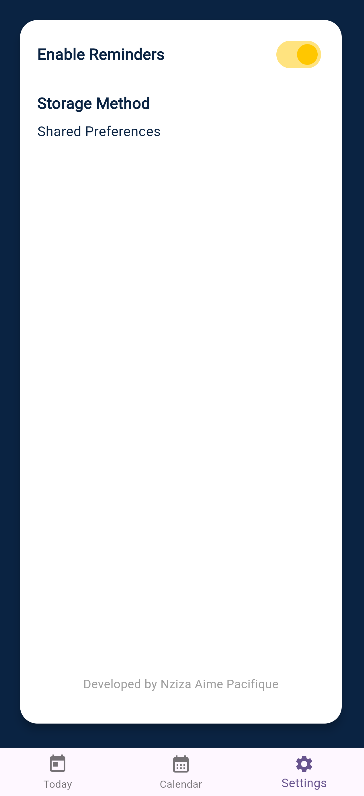

# Study Planner App

A cross-platform Flutter app to help you organize your study schedule, manage tasks, and receive reminders for important deadlines. 

---

## Features

- **Homepage with Navigation**: Bottom navigation bar for Today, Calendar, and Settings screens.
- **Task Management**: Add, edit, and delete study tasks with title, description, due date, and optional reminder.
- **Calendar View**: Monthly calendar to view and manage tasks by date. Dates with tasks are highlighted.
- **Reminders**: Local push notifications for tasks with reminders (Android/iOS). Toggle reminders in settings.
- **Persistent Storage**: All tasks are saved locally using shared_preferences.
- **Swipe Actions**: Swipe right to delete, swipe left to edit tasks in both Today and Calendar screens.
- **Modern UI**: Clean, user-friendly interface with Material Design.

---

## How It Works

### 1. **Home Navigation**
- The app opens to the Today screen, showing all tasks due today.
- Use the bottom navigation bar to switch between Today, Calendar, and Settings.

### 2. **Adding Tasks**
- Tap the "+" button (FAB) on Today or Calendar screens to add a new task.
- Enter a title (required), optional description, select a due date, and optionally set a reminder.
- You can enable a reminder to be notified before the task is due.

### 3. **Viewing & Managing Tasks**
- **Today Screen**: Shows only tasks due today. Swipe **right to delete**, **left to edit**.
- **Calendar Screen**: Shows a monthly calendar. Select any date to see tasks for that day. Swipe **right to delete**, **left to edit**.
- **Edit Task**: Swiping left opens the task form pre-filled for editing.
- **Delete Task**: Swiping right deletes the task after confirmation.

### 4. **Reminders**
- If a reminder is set, the app schedules a local notification for the specified time.
- Reminders can be toggled on/off in the Settings screen (UI only, logic can be extended).

### 5. **Settings**
- Toggle reminders (UI only, does not affect logic by default).
- View the storage method used (Shared Preferences).

### 6. **Persistence**
- All tasks are saved locally and persist between app launches.

---

## Screenshots

Below are five app UI screenshots:

1. 
2. 
3. 
4. 
5. 
6. 

---

## Getting Started

1. **Clone the repository:**
   ```sh
   git clone <your-repo-url>
   cd study_planner
   ```
2. **Install dependencies:**
   ```sh
   flutter pub get
   ```
3. **Run the app:**
   ```sh
   flutter run
   ```
4. **Build APK (Android):**
   ```sh
   flutter build apk
   ```

---

## Project Structure

- `lib/`
  - `main.dart` - App entry point, notification setup
  - `home_page.dart` - Main navigation, Today screen logic
  - `calendar_screen.dart` - Calendar view and per-day task list
  - `add_task_page.dart` - Add/edit task form
  - `settings_screen.dart` - Settings UI
  - `task.dart` - Task model
  - `task_storage.dart` - Local storage logic
- `assets/` - (Add your images/icons/screenshots here)

---

## Notes
- Local notifications require permissions on Android 13+ and iOS.
- The reminder toggle in settings is UI only by default; logic can be extended.
- For best results, add your own app icon and screenshots in the assets folder.

---

## Credits
Developed by Nziza Aime Pacifique
